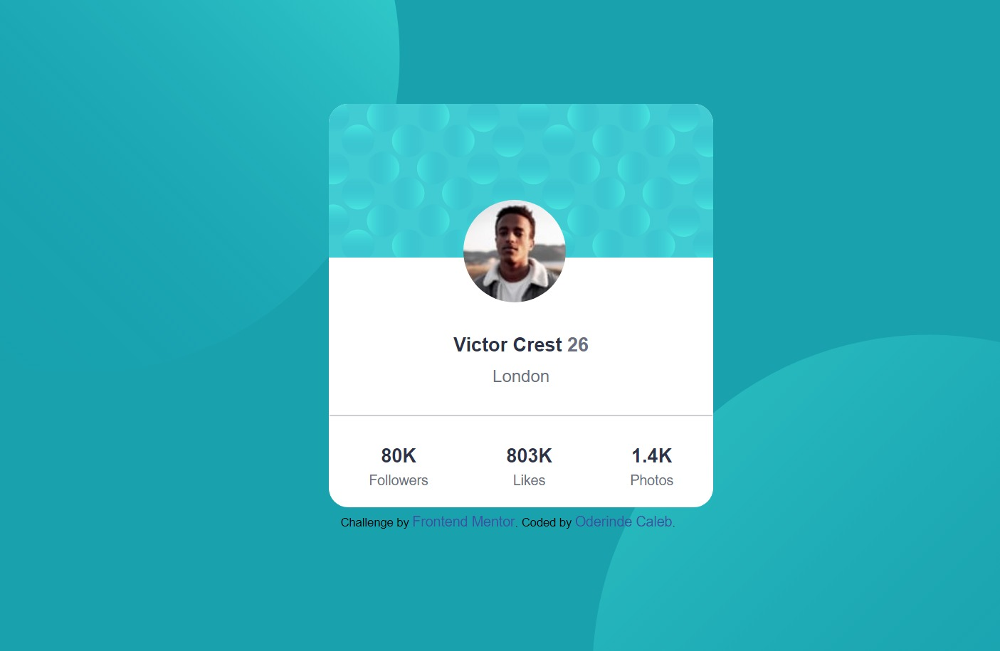

# Frontend Mentor - Profile card component solution

This is a solution to the [Profile card component challenge on Frontend Mentor](https://www.frontendmentor.io/challenges/profile-card-component-cfArpWshJ). Frontend Mentor challenges help you improve your coding skills by building realistic projects. 

## Table of contents

- [Overview](#overview)
  - [The challenge](#the-challenge)
  - [Preview](#Preview)
  - [Links](#links)
  - [Built with](#built-with)
  - [What I learned](#what-i-learned)
  - [Useful resources](#useful-resources)
- [Author](#author)
- [Acknowledgments](#acknowledgments)


## Overview
- A profile card

### The challenge

- Build out the project to the designs provided

### Preview




### Links

- Solution URL: [Add solution URL here](https://your-solution-url.com)
- Live Site URL: [Add live site URL here](https://your-live-site-url.com)


### Built with

- Semantic HTML5 markup
- CSS custom properties

### What I learned
How To Overlap (Or Layer) Elements using CSS

```css
header,
footer {
    position: relative, fixed, etc;
    top: 0;
    left: 0
}

header {
    z-index: -;
}

footer {
    z-index: -;
}
```
### Useful resources

- [Resource 1](https://code-boxx.com/overlap-layer-html-elements/) - This helped me for  overlapping (Or Layering) Elements using CSS. I really liked this pattern and will use it going forward.

## Author

- Frontend Mentor - [@Oderindecaleb](https://www.frontendmentor.io/profile/Oderindecaleb)
- Twitter - [@caleb_oderinde](https://www.twitter.com/caleb_oderinde)


## Acknowledgments
I say a very big thank you to Seyi Onifade(xylus), zuri training, ingressive4good for the opportunity that was give to me to learn frontend development.